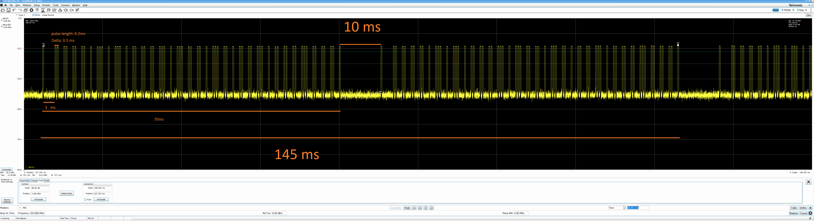
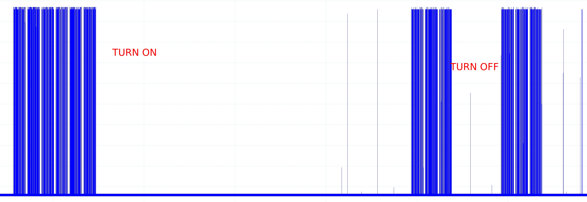

# RPI 433 MHz Nexa Controller
This is a sunday evening project dedicated to solve my problem not being able to use the codebases on the Internet to control Nexa power switch and the controller.

There are tons of projects, but they seem to be copy of each other and none worked. 

I will be taking [RF-switch](https://github.com/sui77/rc-switch/tree/c5645170be8cb3044f4a8ca8565bfd2d221ba182) project as base and modifying it extensively. 


# Hardware list
- RPI 3B+
- Nexa Controller: Model [MYCT-1702](https://nexa.se/smarta-hem/systemnexa/plugin/myc-2300-set)
- Nexa Plug: [MYCR-2300](https://nexa.se/smarta-hem/systemnexa/plugin/myc-2300-set)
- 433 MHz modules: [transmitter FS100A TX and 080408 RX](https://botland.store/radio-modules/3191-radio-module-transmitter-fs100a-receiver-433-mhz-5904422331573.html)

# Requirements
For RPI 3B+ as defined on http://wiringpi.com/wiringpi-updated-for-the-pi-v3plus/ (creator of WirePi), he says you need to install that deb file and install it on your RPI.

```
wget https://unicorn.drogon.net/wiringpi-2.46-1.deb
sudo dpkg -i wiringpi-2.46-1.deb
```
In the PC, you'd need to install `sudo apt-get install libwiringpi-dev` to be able to compile it on the x86.


***Do not use apt install wiringpi***

# Installation
go to `src` directory and run `make` that will generate `rpi_nexa_controller` binary.

# Usage
run as `rpi_nexa_controller <action>` where action is either 0  (turn off) or 1 (turn on). Example
`rpi_nexa_controller 0` to turn off the relay, and `rpi_nexa_controller 1` to turn on the relay


# Protocol
Here is ASK decode of the NEXA controller on the spectrum analyzer:


As I googled, I found [this documentation](https://www.elektronikforumet.com/wiki/index.php?title=RF_Protokoll_-_JULA-Anslut) which corresponds to the above ASK decode. 

 Please note that I wrote the time notes on the picture as an approximate observed values, the accurate ones are in the below section:

The protocol says that:

## Pulse length
1 pulse  = 0.25 ms
10 pulse = 2.5 ms
40 pulse = 10 ms

## Symbols
0    : 1 pulse high + 1 pulse of low = 0.5 ms
1    : 1 pulse high + 5 pulse low    = 1.5 ms
Start: 1 pulse high + 10 pulse low =  2.75 ms
Stop : 1 pulse high + 40 pulse low = 10.25 ms

### Bit definitions: 
bit 0 = 01 signal
bit 1 = 10  signal

Well, this is Manchester coding which is a very common channel coding technique


## Message format: 
`HHHH HHHH HHHH HHHH HHHH HHHH HHGO EEEE`
- `H`: unique home code
- `G`: group command
- `O`: on/off command
- `EEEE`: device to be turned on/off: EEEE is inverted, e.g. 1111 = unit 0, 1110 = unit 1, ..

S:01 01 01 01 10 01 10 01 10 10 10 10 01 10 01 01 01 10 01 01 10 10 10 01 10 10 10 01 01 01 01 01

Message: 0000 1010 1111 0100 0100 1110 1110 0000 = 0xAF44EE0
Message: HHHH HHHH HHHH HHHH HHHH HHHH HHGO EEEE

in my use case, `0xAF44EF0` is the turn on, and `0xAF44EE0` is the turn off code. You can see that the only difference is the `G` bit. 

Please note that your `H` values will be different in your devices.  

Here is the high the package repetition

It shows that turn on message is repeated 6 times consequitively. The turn off message is repeated 3 times, and another 3 time repetation after the ~260 ms 0s period.


# Missing parts:
I didn't implement the `sniffer` part. I decoded the message key via spectrum analyzer and then oscilloscope. You don't have to use a spectrum analyzer. I just used SA as my first step of the reverse engineering and then oscilloscope was the confirmation.

This is not a generic controller, I don't know if it works with all the rest Nexa modules, but it works with the modules that I had. The perfect thing is that it works :) 